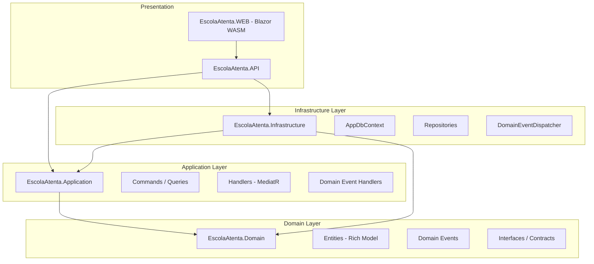
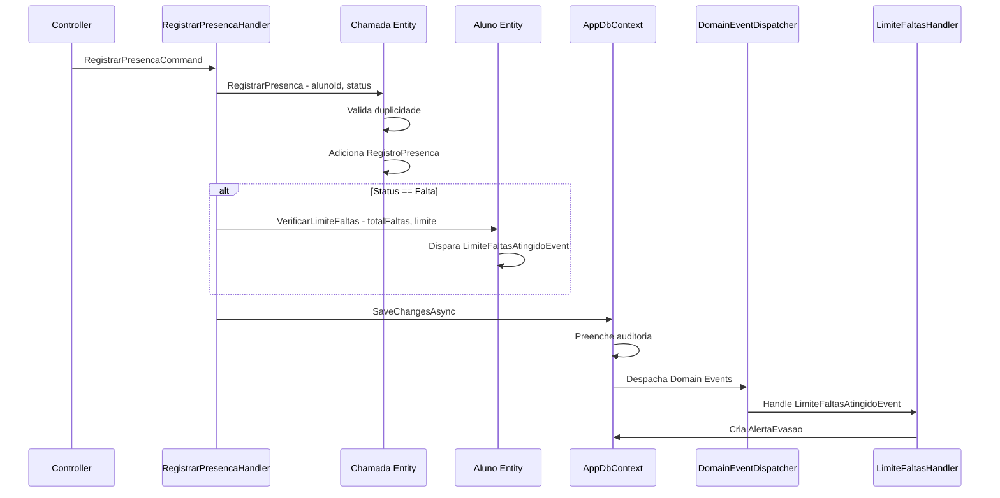
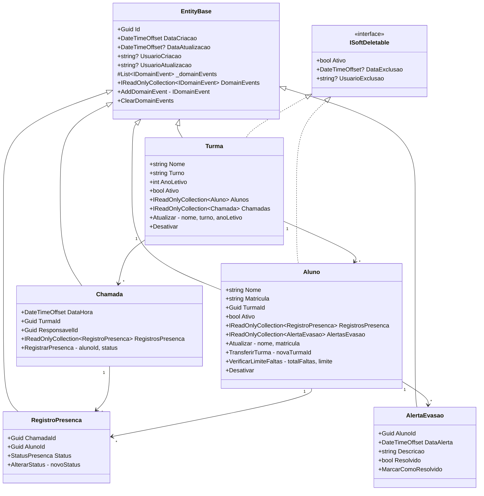

# Plano Arquitetural — EscolaAtenta

## 1. Análise Crítica do Estado Atual

### 1.1 Diagnóstico do Domínio (CRÍTICO)

O domínio atual é **completamente anêmico**. As entidades são meros DTOs com propriedades auto-implementadas e zero lógica de negócio. Problemas identificados:

| Problema | Severidade | Entidade |
|----------|-----------|----------|
| `ICollection<T>` expõe mutação externa | Alta | Todas |
| Sem validação de invariantes no construtor | Alta | Todas |
| Sem métodos de negócio | Alta | `Chamada`, `Aluno` |
| Sem Domain Events | Média | `Aluno`, `Chamada` |
| Sem Entity base com campos de auditoria | Média | Todas |
| Primary constructors expõem criação sem validação | Alta | Todas |
| Sem proteção contra exclusão física | Alta | `Aluno`, `Turma` |

### 1.2 Diagnóstico da Infraestrutura

| Problema | Severidade |
|----------|-----------|
| Sem concorrência otimista — risco de Lost Updates | Alta |
| Sem campos de auditoria — DataCriacao, DataAtualizacao | Alta |
| Sem Soft Delete — exclusão física de dados críticos | Alta |
| Sem Global Query Filters | Média |
| Sem interceptação de SaveChanges para auditoria | Alta |

### 1.3 Diagnóstico da API

| Problema | Severidade |
|----------|-----------|
| CORS `AllowAnyOrigin` — vulnerabilidade de segurança | **Crítica** |
| Sem Health Checks — impossível monitorar em produção | Alta |
| Sem Serilog — logs não estruturados | Alta |
| Sem Global Exception Handler — stack traces expostos | **Crítica** |
| Sem API Versioning | Média |
| Sem Problem Details RFC 7807 | Alta |
| Credenciais hardcoded no appsettings.json | **Crítica** |

### 1.4 Diagnóstico do Frontend

| Problema | Severidade |
|----------|-----------|
| Template padrão Blazor sem customização | Baixa |
| Sem tema areia branca/dourado | Baixa |
| Páginas de exemplo Counter/Weather ainda presentes | Baixa |

---

## 2. Arquitetura Alvo

### 2.1 Visão Geral da Clean Architecture



### 2.2 Fluxo de Domain Events — Alerta de Evasão



### 2.3 Modelo de Entidades Refatorado



---

## 3. Decisões Arquiteturais e Trade-offs

### 3.1 Rich Domain Model vs. Anemic Domain Model

**Decisão:** Rich Domain Model com proteção de invariantes.

**Justificativa:** O domínio de presença escolar possui regras de negócio claras — duplicidade de aluno em chamada, limite de faltas para evasão, transferência de turma. Manter essas regras no domínio garante que nenhum consumidor externo possa violar invariantes, independente de qual camada invoque a operação.

**Trade-off:** Maior complexidade nas entidades, mas elimina bugs de consistência que surgiriam com lógica espalhada em services.

### 3.2 Domain Events via MediatR

**Decisão:** Despacho de Domain Events no `SaveChangesAsync` via MediatR `INotification`.

**Justificativa:** Desacopla a geração de `AlertaEvasao` do fluxo de registro de presença. O handler de alerta pode falhar sem comprometer o registro da chamada, se configurado com retry ou outbox pattern futuro.

**Trade-off:** Despacho síncrono no mesmo transaction scope por ora. Para escala futura, migrar para outbox pattern com background worker. Não implementar outbox agora evita overengineering prematuro.

**Risco mitigado:** Se o handler de alerta falhar, o `SaveChangesAsync` fará rollback de tudo. Isso é aceitável nesta fase porque a criação do alerta é idempotente e pode ser recriada.

### 3.3 Concorrência Otimista com xmin do PostgreSQL

**Decisão:** `UseXminAsConcurrencyToken()` nas entidades `Chamada` e `RegistroPresenca`.

**Justificativa:** O `xmin` é o transaction ID nativo do PostgreSQL que muda a cada UPDATE. É zero-cost — não requer coluna adicional no schema. O EF Core compara o `xmin` no WHERE do UPDATE e lança `DbUpdateConcurrencyException` se houve mudança concorrente.

**Trade-off:** `xmin` é específico do PostgreSQL. Se migrar para outro banco, precisará de `RowVersion`/`Timestamp`. Aceitável dado que PostgreSQL é a escolha definitiva do projeto.

### 3.4 Soft Delete com Global Query Filters

**Decisão:** Interface `ISoftDeletable` com campo `Ativo` + `DataExclusao` + `UsuarioExclusao`. Global Query Filter `entity.Ativo == true`.

**Justificativa:** Alunos e turmas não podem ser excluídos fisicamente por questões legais e de auditoria educacional. O Global Query Filter garante que queries normais nunca retornem registros excluídos, mas permite acesso explícito via `IgnoreQueryFilters()`.

**Trade-off:** Queries ficam ligeiramente mais complexas. Índices filtrados `WHERE Ativo = true` devem ser criados para performance.

### 3.5 Auditoria Automática no SaveChangesAsync

**Decisão:** Override de `SaveChangesAsync` para preencher `DataCriacao`, `DataAtualizacao`, `UsuarioCriacao`, `UsuarioAtualizacao` automaticamente.

**Justificativa:** Elimina a possibilidade de esquecer campos de auditoria em qualquer operação. O `ICurrentUserService` extrai o usuário do `HttpContext.User`.

### 3.6 Serilog com Logs Estruturados

**Decisão:** Substituir `ILogger` padrão por Serilog com sink para Console estruturado e arquivo.

**Justificativa:** Logs estruturados permitem queries em ferramentas como Seq, Elasticsearch ou Grafana Loki. Essencial para troubleshooting em produção.

### 3.7 CORS Estrito

**Decisão:** Remover `AllowAnyOrigin`. Ler origens permitidas do `appsettings.json`.

**Justificativa:** `AllowAnyOrigin` é uma vulnerabilidade de segurança que permite qualquer site fazer requests à API. Em produção, apenas o domínio do Blazor WASM deve ter acesso.

### 3.8 API Versioning

**Decisão:** Versionamento via URL path (`/api/v1/...`) usando `Asp.Versioning.Mvc`.

**Justificativa:** Permite evolução da API sem quebrar clientes existentes. URL path é mais explícito e fácil de debugar que header-based versioning.

---

## 4. Estrutura de Diretórios Alvo

```
src/
├── EscolaAtenta.Domain/
│   ├── Common/
│   │   ├── EntityBase.cs
│   │   ├── ISoftDeletable.cs
│   │   └── IDomainEvent.cs
│   ├── Entities/
│   │   ├── Aluno.cs
│   │   ├── Turma.cs
│   │   ├── Chamada.cs
│   │   ├── RegistroPresenca.cs
│   │   └── AlertaEvasao.cs
│   ├── Events/
│   │   ├── LimiteFaltasAtingidoEvent.cs
│   │   └── PresencaRegistradaEvent.cs
│   ├── Enums/
│   │   └── StatusPresenca.cs
│   ├── Exceptions/
│   │   ├── DomainException.cs
│   │   └── BusinessRuleViolationException.cs
│   └── Interfaces/
│       ├── IUnitOfWork.cs
│       └── ICurrentUserService.cs
│
├── EscolaAtenta.Application/
│   ├── Common/
│   │   └── Behaviors/
│   │       └── LoggingBehavior.cs
│   ├── Chamadas/
│   │   ├── Commands/
│   │   │   └── RegistrarPresencaCommand.cs
│   │   └── Handlers/
│   │       └── RegistrarPresencaHandler.cs
│   └── EventHandlers/
│       └── LimiteFaltasAtingidoHandler.cs
│
├── EscolaAtenta.Infrastructure/
│   ├── Data/
│   │   ├── AppDbContext.cs
│   │   ├── Configurations/
│   │   │   ├── TurmaConfiguration.cs
│   │   │   ├── AlunoConfiguration.cs
│   │   │   ├── ChamadaConfiguration.cs
│   │   │   ├── RegistroPresencaConfiguration.cs
│   │   │   └── AlertaEvasaoConfiguration.cs
│   │   └── Migrations/
│   └── Services/
│       ├── CurrentUserService.cs
│       └── DomainEventDispatcher.cs
│
├── EscolaAtenta.API/
│   ├── Program.cs
│   ├── Middleware/
│   │   └── GlobalExceptionHandler.cs
│   ├── appsettings.json
│   └── appsettings.Development.json
│
└── EscolaAtenta.WEB/
    ├── wwwroot/css/app.css  (tema areia branca + dourado)
    └── Layout/
```

---

## 5. Pacotes NuGet Necessários

### Domain
- `MediatR.Contracts` — apenas interfaces `INotification` para Domain Events, sem dependência do MediatR completo

### Application
- `MediatR` — mediator pattern para Commands, Queries e Event Handlers

### Infrastructure
- `Npgsql.EntityFrameworkCore.PostgreSQL` — já presente
- `Microsoft.EntityFrameworkCore` — já presente

### API
- `Serilog.AspNetCore` — logging estruturado
- `Serilog.Sinks.Console` — sink para console
- `Serilog.Sinks.File` — sink para arquivo
- `AspNetCore.HealthChecks.NpgSql` — health check do PostgreSQL
- `Asp.Versioning.Mvc` — versionamento de API
- `Asp.Versioning.Mvc.ApiExplorer` — integração com Swagger

---

## 6. Fases de Implementação

### FASE 1 — Domínio (Fundação)
1. Criar `EntityBase` com Id, campos de auditoria e suporte a Domain Events
2. Criar `ISoftDeletable` com Ativo, DataExclusao, UsuarioExclusao
3. Criar `IDomainEvent` como marker interface
4. Criar `DomainException` e `BusinessRuleViolationException`
5. Refatorar todas as entidades para herdar de `EntityBase`
6. Implementar `IReadOnlyCollection<T>` em todas as navegações
7. Adicionar métodos de negócio: `Chamada.RegistrarPresenca()`, `Aluno.VerificarLimiteFaltas()`
8. Criar Domain Events: `LimiteFaltasAtingidoEvent`, `PresencaRegistradaEvent`
9. Adicionar `Justificada` ao enum `StatusPresenca`

### FASE 2 — Infraestrutura
1. Refatorar `AppDbContext` com override de `SaveChangesAsync` para auditoria
2. Implementar Soft Delete no `SaveChangesAsync` — interceptar `EntityState.Deleted`
3. Adicionar Global Query Filters para `ISoftDeletable`
4. Configurar `UseXminAsConcurrencyToken()` em `Chamada` e `RegistroPresenca`
5. Extrair configurações de entidades para classes `IEntityTypeConfiguration<T>` separadas
6. Implementar `ICurrentUserService` com acesso ao `HttpContext`
7. Implementar `DomainEventDispatcher` que despacha via MediatR no `SaveChangesAsync`

### FASE 3 — Application
1. Adicionar MediatR ao projeto
2. Criar `RegistrarPresencaCommand` e `RegistrarPresencaHandler`
3. Criar `LimiteFaltasAtingidoHandler` para gerar `AlertaEvasao` de forma desacoplada
4. Criar `LoggingBehavior` como pipeline behavior do MediatR

### FASE 4 — API
1. Refatorar `Program.cs` com Serilog, Health Checks, CORS estrito
2. Implementar `GlobalExceptionHandler` com Problem Details RFC 7807
3. Configurar API Versioning
4. Atualizar `appsettings.json` com seções de CORS, Serilog, limites configuráveis

### FASE 5 — Frontend Blazor
1. Aplicar paleta areia branca claro com dourado no CSS
2. Customizar layout e navegação

### FASE 6 — Migration
1. Gerar nova migration para refletir campos de auditoria, soft delete e concorrência

### FASE 7 — Testes
1. Testes unitários para entidades de domínio
2. Testes para regras de negócio — duplicidade, limite de faltas

---

## 7. Riscos e Mitigações

| Risco | Probabilidade | Impacto | Mitigação |
|-------|--------------|---------|-----------|
| Domain Events falham e fazem rollback da chamada | Média | Alto | Implementar retry no handler; futuro: outbox pattern |
| Concorrência otimista gera muitos conflitos | Baixa | Médio | Retry automático no handler com backoff |
| Soft Delete causa inconsistência em queries | Baixa | Médio | Global Query Filters + testes |
| Migration quebra dados existentes | Média | Alto | Campos novos com default values; migration incremental |
| Credenciais no appsettings.json | Alta | **Crítico** | User Secrets em dev; variáveis de ambiente em prod |

---

## 8. Nota sobre Segurança

**ALERTA CRÍTICO:** O arquivo `appsettings.json` contém credenciais do banco de dados em texto plano (`Password=A3952b`). Isso **nunca** deve ir para um repositório Git. Recomendações:
1. Usar `dotnet user-secrets` em desenvolvimento
2. Usar variáveis de ambiente ou Azure Key Vault em produção
3. Adicionar `appsettings.*.json` ao `.gitignore` (exceto templates sem credenciais)
